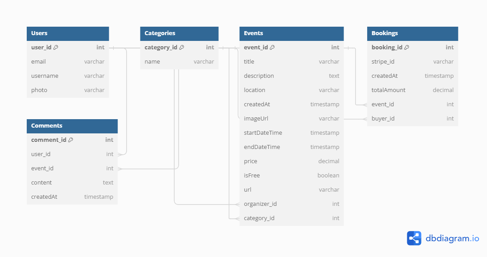

# EventFlow

## 1. Introduction

### EventFlow Overview

EventFlow is an event management application where users can search for events, register their own events, and recruit participants. The app aims to streamline the process of organizing and discovering events, making it easier for users to connect with and engage in various events.

## 2. Design

### Overview

- **Design Concept**: The main focus is to have a simple and easy-to-use platform, with a clear and understandable layout, being accessible to as many customers as possible whether they want to find events or publish and promote their events.
- **UI/UX Design**: We simplified the search for events with a category filter, as well as a search bar. When creating or editing events, there’s a form, to compile all the information about the events more precisely. As an effort to help people connect about the events, there’s an attendance list, as well as a comment section. Finally, the created and assisting events are compiled in two different lists with the main information displayed and available.
- **Wireframes/Mockups**: There are three main pages for this website, being Home Screen, Event List, and profile, from there, we have the Event Detail Page tailored to every event on the website, which comes from filling out the form to create an event.

### Design Tools
- **Figma**: [Event Planner](https://www.figma.com/design/qiwCBraPizBmIrcvX2rQA6/Event-Planer?node-id=0-1&t=AO0viUDo5Uah70hn-1)  
- **FiJam Board**: [Event Management](https://www.figma.com/board/cQXUlSh1v4OOQDKN7lAtrC/Event-Management?node-id=0-1&t=K248OLvOeV795QQV-1)  
- **Adobe Illustrator**: Used for logo design

### Style Guide
- **Main Colors**:
  - Primary: `#1E285D` (main components and buttons)
  - Details and Logo: `#C0D0E7`
  - Text and Extra Details: `#FFFFFF`
- **Font**: “Inter” for the entire website

## 3. Frontend

### Overview

- **Technology Stack**: 
  - Next.js: A front-end framework that uses server-side rendering and static site generation to build fast and SEO-friendly applications.
  - Tailwind CSS: A utility-first CSS framework that allows for efficient and responsive design development.
  - shadcn: A UI component library that offers beautiful and user-friendly components.
  - Stripe: A payment processing platform integrated into the app, enabling secure event payments.
  - Zustand: A lightweight and scalable state management library that ensures consistency across the application.

- **Directory Structure:**
  - app/: Manages routing and logic for each page using Next.js app router.
  - components/: Houses reusable UI components that maintain UI consistency across the application.
  - styles/: Contains custom styles and global styles that complement Tailwind CSS, reflecting the design rules across the project.
  - lib/: Manages logic and helper functions related to external API communication and data processing.
  - store/: Hosts Zustand state management logic, which handles the global state used throughout the application.
  - public/: Stores static assets (e.g., images, fonts) that are directly accessible by the client.

- **Data Flow:**
  - Zustand handles state management, ensuring simple and consistent state sharing between React components.
  - UI components are designed based on shadcn, separating page components from UI components to enhance maintainability.

### Deployment

- **Live Application URL**: https://event-flow-frontend-wine.vercel.app
## 4. Backend

### Tech Stack

For the backend, we utilized the following technologies:

- **Framework**: Express.js
- **Database**: MongoDB
- **Authentication**: JSON Web Tokens (JWT)

### Overview

Our backend is built using **Express.js**, a popular Node.js framework that provides robust features for building web and mobile applications. We chose **MongoDB** as our database due to its flexibility and scalability, which aligns with the requirements of our application.

### Database Design

## 5. Portfolio Links

- [Azul Belmonte](https://designer-portfolio.com) - Design
- [Ryoma Suzuki](https://frontend-developer-portfolio.com) - Frontend Development
- [Kento Kuki](https://kento-portfolio.vercel.app/) - Backend Development
